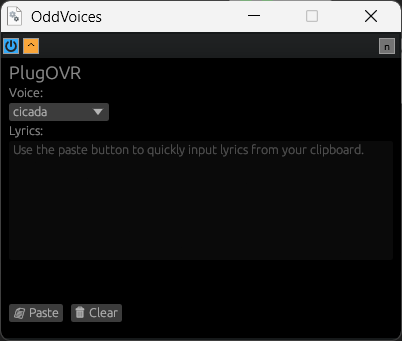

## PlugOVR

**A pure Rust port, packaged as an audio plugin, of [OddVoices](https://gitlab.com/oddvoices/oddvoices/), a singing synthesizer for General American English.**

### What is this?
A Vocaloid or UTAU-like vocal synth that can be used directly in your DAW of choice as a VST3. The underlying engine that powers PlugOVR, OddVoices, is built around automatic phonemization, meaning all you have to provide is plain English lyrics and the engine will do the heavy lifting of interpreting the pronounciation. Both the voice samples and pronounciation data are public domain, so this plugin should yield output that is public domain as well.

The 0.1 version of this project was written using a fully-local LLM toolchain described in the subscript. For the first time, I was able to use fully-offline tools, including the LLM itself, to port C++ code to Rust with little intervention on my part. Porting the OddVoices synth engine to Rust made it trivial to use NIH-Plug to package it as an audio plugin.

### How do I use it?
Choose a voice, paste in your lyrics using the paste button, and you're good to go. The plugin will automatically advance through the lyrics with each successive note played. Since it's fairly easy to have sync issues with this setup, I added an automatable parameter to the plugin called Reset. If you automate it as shown below, the plugin will now know where the start of your music is. All you have to do is automate a pure `1.0` value for a short period and the plugin will reset to the start of the lyrics. **Make sure to keep a copy of your lyrics somewhere else, as PlugOVR provides no way to edit, save, or re-copy your lyrics. The purpose of the text box is purely to see what text has been provided to the plugin.**

### How do I install it or build it?

The [Releases](https://github.com/EuphoricPenguin/PlugOVR/releases) page has binaries built for Windows, but you should be able to build the source for other platforms.

If you're using a DAW like [LMMS](lmms.io) that lacks VST3 support, you can use [Element](https://github.com/kushview/element/releases) to host VST3 plugins.

To get it working, copy the [voices](https://gitlab.com/oddvoices/oddvoices/-/tree/develop/voices?ref_type=heads) folder to the main directory after cloning this repo. Install Python and Rustup/Rust. Run `pip -r requirements.txt` and  `python compile_voices.py` to build the voice binaries. After that, run `.\build_vst3.bat` to build the project.

### Licensing
PlugOVR, a derivative of OddVoices, is licensed under the Apache-2.0 License.
OddVoices is (c) 2021 Nathan Ho and licensed under the Apache-2.0 License. See LICENSE for more information.
The [voice source files](https://gitlab.com/oddvoices/oddvoices/-/tree/develop/voices?ref_type=heads), available in the original repo, are dedicated to the public domain via CC0.
The Moby Pronunciator II [phonetic dictionary](https://github.com/elitejake/Moby-Project) is dedicated to the public domain.
Third-party licenses apply to binary files: see THIRDPARTY.yml for more info.

The 0.1 version of PlugOVR was created using a fully-local LLM toolchain consisting of Cline, Qwen-3.6-35B-A3B, and Grounded Docs MCP Server with Granite-Embedding-278m-multilingual. 0.2/0.3 had several minor issues fixed using DeepSeek V4 Flash and Gemini-3-Flash via Cline. The plugin frontend was created by DeepSeek V4 Flash via Cline.